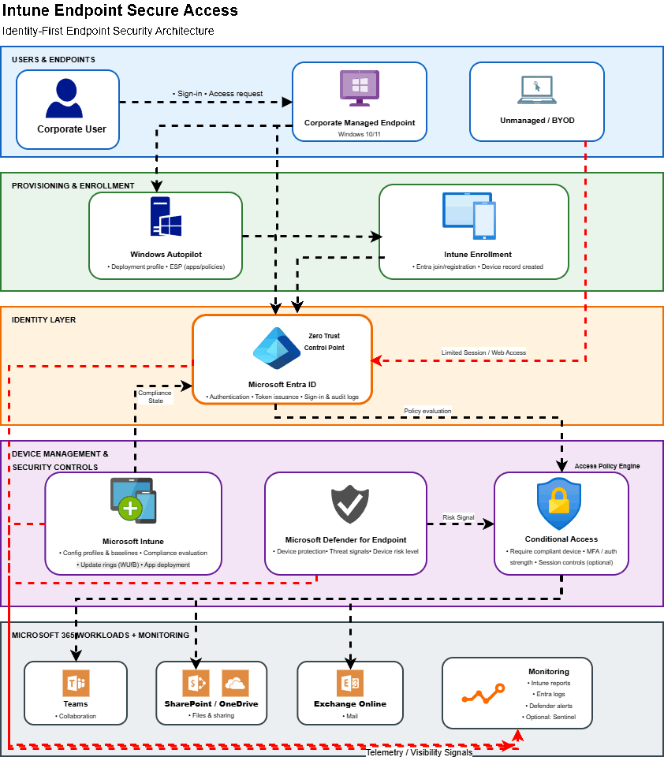

# Endpoint Security Architecture

---

## Overview

This document describes the identity-first endpoint security architecture used to control access to Microsoft 365 workloads. The design reflects an anonymised real-world implementation and focuses on how authentication context, device posture, and risk telemetry work together to enforce secure access decisions.

Rather than relying on a single control layer, the architecture distributes responsibility across identity, endpoint management, threat detection, and policy enforcement. Microsoft Entra ID acts as the central Zero Trust control point, while Microsoft Intune and Microsoft Defender for Endpoint provide continuous signals that influence Conditional Access evaluation.

---

## Architecture Diagram

The architecture diagram provides a structural view of how users, endpoints, identity services, management platforms, and monitoring components interact within the environment.

---

## Architectural Principles

Several key principles influenced the design:

* **Identity-First Security**
  Access decisions originate from Microsoft Entra ID rather than individual applications or network location.

* **Continuous Evaluation**
  Device compliance and risk signals are evaluated dynamically during authentication instead of being enforced through static controls.

* **Layered Enforcement**
  Endpoint management, threat intelligence, and Conditional Access policies operate together to reduce reliance on any single security mechanism.

* **Operational Visibility**
  Monitoring and telemetry flows ensure that authentication behaviour, device posture, and policy outcomes remain observable.

---

## Access Request and Context Collection

When a user attempts to access a Microsoft 365 workload such as Teams, SharePoint, or Exchange Online, the authentication request is routed through Microsoft Entra ID. During this stage, contextual information is collected, including:

* User identity and group membership
* Device state and registration status
* Client application and authentication method
* Network or location signals where applicable

This context forms the foundation for subsequent policy evaluation.

---

## Identity Layer — Zero Trust Control Point

Microsoft Entra ID serves as the central decision authority within the architecture. All authentication requests pass through this layer before access is granted to workloads.

Key responsibilities include:

* Authenticating users and issuing tokens
* Evaluating Conditional Access policies
* Aggregating signals from device management and security platforms
* Recording sign-in and audit telemetry

By positioning identity as the control point, the architecture avoids dependency on traditional perimeter-based security models.

---

## Device Management Signals — Microsoft Intune

Microsoft Intune contributes device posture information used during access evaluation.

Compliance policies define the baseline security requirements expected from managed endpoints, such as:

* Encryption and security configuration alignment
* Operating system requirements
* Device health and configuration status

Rather than blocking access directly, Intune provides a **compliance state signal** that Conditional Access policies consume during evaluation. This separation maintains clear architectural boundaries between management and enforcement layers.

---

## Risk Telemetry — Microsoft Defender for Endpoint

Microsoft Defender for Endpoint provides additional context through device risk signals.

These signals represent the current security posture of an endpoint, including threat indicators or behavioural anomalies. Integrating Defender telemetry allows the architecture to respond to evolving threats rather than relying solely on static device configuration.

Risk data does not independently block access. Instead, it informs Conditional Access decisions alongside identity and compliance information.

---

## Policy Enforcement — Conditional Access

Conditional Access functions as the policy engine that translates identity and device signals into access outcomes.

Policies evaluate multiple conditions simultaneously, including:

* Device compliance state from Intune
* Device risk level from Defender for Endpoint
* Authentication strength or MFA requirements
* Session control requirements

Based on the combined evaluation, Conditional Access determines whether access should be fully allowed, restricted, or blocked.

This layered enforcement approach enables adaptive access decisions aligned with Zero Trust principles.

---

## Managed vs Unmanaged Device Paths

The architecture distinguishes between corporate-managed endpoints and unmanaged or personal devices.

* **Corporate Managed Endpoints**
  Devices enrolled through Windows Autopilot and Intune follow a structured onboarding process. Compliance signals and risk telemetry allow these devices to meet policy requirements and gain full access when appropriate.

* **Unmanaged or BYOD Devices**
  Personal or unknown devices are routed through a limited access path. Conditional Access policies can enforce browser-based sessions or reduced privileges, ensuring productivity while maintaining security boundaries.

---

## Monitoring and Telemetry

Operational visibility is provided through aggregated telemetry across identity, management, and security platforms.

Monitoring typically includes:

* Entra ID sign-in logs and audit events
* Intune compliance reporting
* Defender for Endpoint alerts and device risk insights

These signals provide feedback loops that allow administrators to refine policies and detect anomalies early.

The inclusion of monitoring within the architecture highlights that secure access is an ongoing operational process rather than a one-time configuration.

---

## Relationship to Conditional Access Decision Flow

While this diagram illustrates structural architecture, the Conditional Access Decision Flow diagram focuses on logical policy evaluation.

Together, the diagrams provide two complementary perspectives:

* **Architecture View** — how components interact across layers
* **Decision Flow View** — how signals are evaluated to determine access outcomes

This separation helps maintain clarity between system design and policy logic.

---

## Summary

The endpoint security architecture demonstrates a modern, identity-centric approach to securing Microsoft 365 environments. By combining Microsoft Entra ID, Intune, Defender for Endpoint, and Conditional Access into a unified model, access decisions become adaptive and context-aware.

Rather than enforcing rigid network boundaries, the design prioritises identity verification, device posture, and risk awareness, enabling secure collaboration without sacrificing usability.
